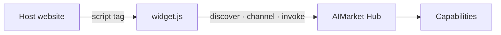

# Killer feature: 1-Click Agent Embed

**Product:** `aimarket-widget`  
**Tagline:** *Embed a production AI agent in any app in ~60 seconds.*

## The problem

Teams want marketplace capabilities **inside their product** (blog, SaaS, internal tool) but hit:

- Weeks integrating discover + wallet + invoke APIs
- XSS / CSP nightmares with ad-hoc iframes
- No affiliate or channel economics for the host site

## The killer answer

**1-Click Agent Embed** — one script tag, full agent UX:

```html
<script src="https://modelmarket.dev/widget/widget.js"
        data-theme="auto"
        data-intent="summarize this article"
        data-budget="3.00"
        data-hub-url="https://modelmarket.dev"
        data-affiliate-id="my_product"></script>
```

| Capability | Built-in |
|------------|----------|
| **Discover UI** | Intent search → ranked capabilities |
| **Wallet channel** | Budget cap via `data-budget` |
| **Invoke + receipt** | Hub v2 API, safety gate |
| **Theme auto** | `data-theme="auto"` matches parent page |
| **Affiliate** | 30% rev-share on visitor spend |
| **Security** | No inline handlers; `textContent` only |

## 60-second integration checklist

1. Copy snippet above into your layout (footer, sidebar, article template).
2. Set `data-affiliate-id` to your product id.
3. Optionally set `data-intent` default for your vertical.
4. Deploy — widget loads async, connects to hub, respects CSP-friendly script src.

**Demo:** [modelmarket.dev/widget/demo](https://modelmarket.dev/widget/demo)

## Why this wins

| Approach | Time to production | Economics |
|----------|-------------------|-----------|
| Raw REST integration | Weeks | DIY billing |
| ChatGPT iframe | Hours | No capability market |
| **AIMarket widget** | **~60 seconds** | Channels + affiliate |

## Architecture



## Distribution

- Static bundle: [`widget.js`](../widget.js) / CDN on hub
- Used by factory-shipped landings and desktop apps’ web demos
- Pairs with **Zero-Trust Discovery** (hub) and **TEE Escrow** (plugins)

See also: [../README.md](../README.md) · [../../docs/killer-features.md](../../docs/killer-features.md)
